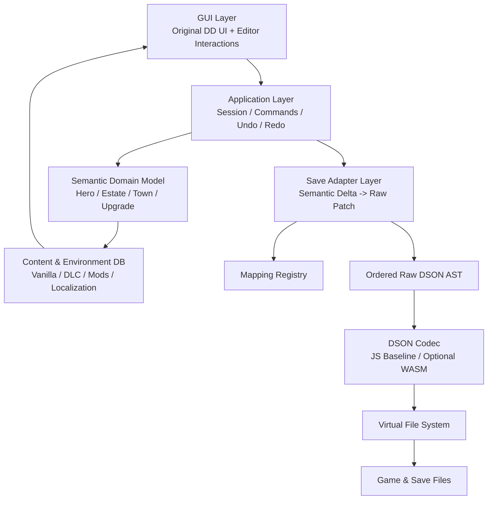
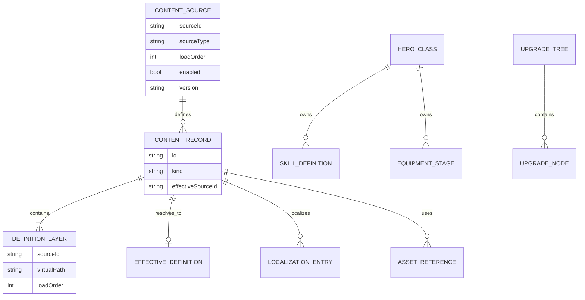
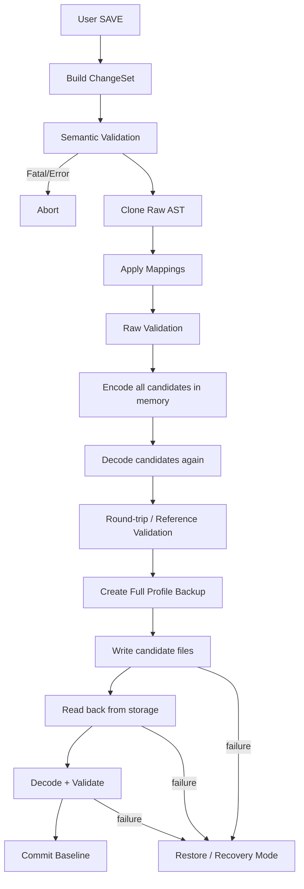

# Darkest Dungeon 1 Sandbox Save Editor
## 专业开发设计文档（Development Design Document）

> 文档版本：**v1.0**  
> 作者：**小依（项目所有者） / OpenAI GPT-5.6 Sol（技术整理）**  
> 状态：**Development Baseline / 可进入实现阶段**  
> 日期：**2026-09-18**  
> 项目：**Darkest Dungeon 1 Sandbox Save Editor**  
> 目标平台：**桌面浏览器优先，HTML + CSS + JavaScript 为主，渐进增强支持本地文件系统**  
> 目标游戏：**Darkest Dungeon 1**  
> 适用范围：**架构设计、开发实现、代码评审、测试验收、存档 Mapping 维护**  
> 设计基线：**Mod-aware / Semantic / Non-destructive / Original-UI Sandbox Editor**

---

# 0. 文档信息与使用说明

## 0.1 文档目的

本文档将既有功能设计、架构草案与真实完整 Campaign 存档 `profile_0(1).zip` 的结构分析合并为一份可直接指导开发、代码评审、测试和后续逆向 Mapping 的工程设计基线。

本文档不再把 Campaign Save 的核心结构视为纯推测。对本次样本中已经实际解析出的结构，统一标记为 `VERIFIED-SAMPLE`；仍需要通过游戏内 Controlled Mutation 或游戏资源定义才能最终确认语义的字段，标记为 `VERIFIED-STRUCTURE / PENDING-SEMANTICS`。

## 0.2 适用范围

v1.0 重点覆盖：

- Campaign 存档发现、读取、解析和安全写回；
- 英雄已有状态编辑；
- 英雄等级、武器、护甲、技能、怪癖、疾病、饰品、压力等语义模型；
- Estate 资源与饰品库存；
- Building / District / Upgrade 状态；
- Mod / DLC / Localization / Asset 的内容数据库；
- Operation、Undo/Redo、Validation、Backup、Commit Transaction；
- 原版 Darkest Dungeon 风格 GUI 与编辑交互；
- Mod-heavy 环境下的未知字段保留和部分实体降级；
- 浏览器环境兼容、部署、日志、测试与风险控制。

v1.0 不要求完成：

- Raid 中途存档的任意状态编辑；
- Butcher's Circus 语义编辑；
- Campaign Log / Narration / Tutorial 的可视化编辑；
- 任意未知 Mod 私有字段的通用表单编辑；
- 在线账号、云同步、服务器数据库或远程 REST 服务。

## 0.3 术语

| 术语 | 定义 |
|---|---|
| DSON | Darkest Dungeon 使用的专有二进制存档格式，扩展名为 `.json` 但并非标准 JSON |
| Raw AST | 能保留字段顺序、重复字段、原始类型、未知数据和元数据的底层 DSON 抽象语法树 |
| Semantic Model | 面向用户与业务逻辑的英雄、庄园、建筑、饰品等游戏语义模型 |
| Content Database | 从 Vanilla / DLC / Mod / Localization 读取并归一化出的游戏内容定义数据库 |
| Mapping | Semantic Property 与 Raw DSON 具体路径、类型、转换和验证规则之间的映射 |
| Environment | 当前游戏版本、DLC、Mod、加载顺序、语言及实际内容定义的组合 |
| Operation | 一次可撤销、可验证的编辑语义操作 |
| ChangeSet | 保存前由 Operation Log 归并出的待提交变更集合 |
| VFS | Virtual File System，对浏览器目录句柄、ZIP、测试 Fixture、内存文件系统的统一抽象 |

## 0.4 证据等级

| 等级 | 含义 | 是否允许写入 |
|---|---|---|
| `VERIFIED-SAMPLE` | 已从本次真实存档直接解析并确认字段结构与类型 | 是，前提是语义也明确 |
| `VERIFIED-FORMAT` | 已由 DSON 格式文档与成熟实现确认 | 是 |
| `VERIFIED-STRUCTURE` | 路径与类型已确认，但字段真实业务语义仍需进一步实验 | 默认只读或实验性 |
| `VERIFIED-ROLE` | 已知文件整体职责，但具体字段未完成 Mapping | 否 |
| `PENDING-MAPPING` | 仅有领域推断，需要 Controlled Mutation | 否 |
| `EXPERIMENTAL` | 用户明确开启 Sandbox 高风险覆盖后允许 | 是，必须告警 |

---

# 1. 背景与目标

## 1.1 项目背景

Darkest Dungeon 1 的存档文件虽然使用 `.json` 扩展名，实际保存为 DSON 二进制结构。普通 JSON 编辑器无法安全地完成原样 round-trip；同时 Mod 环境会引入自定义英雄、技能、怪癖、疾病、饰品、建筑、资源以及覆盖式本地化，使“写死 Vanilla ID 和字段规则”的传统存档编辑器难以适应重度 Mod 环境。

项目目标不是开发一个通用二进制编辑器，而是实现一个理解游戏环境和游戏语义的 Sandbox Save Editor：用户看到并操作的是英雄等级、技能、装备、怪癖、饰品、资源和建筑，而不是 DSON 偏移或 Raw Field。

## 1.2 业务目标

1. 允许玩家在不逐个查询 Mod ID 的情况下浏览并修改当前游戏环境中可用的英雄、饰品、怪癖、疾病等内容。
2. 尽可能复用 Darkest Dungeon 原版视觉资产和界面布局，仅为原版 UI 增加编辑器操作语义。
3. 所有编辑必须具备撤销、预览、风险提示、备份、校验和失败恢复能力。
4. 对未知 Mod 字段和未理解数据采用“保留而不是清理”的策略。
5. 在 Vanilla、全 DLC、轻度 Mod、重度 Mod、超大英雄池环境中保持结构稳定。

## 1.3 设计目标

核心设计目标：

```text
Preserve Raw Data
        +
Model Game Semantics
        +
Apply Explicit Operations
        +
Validate Every Commit
```

对应工程要求：

- **非破坏性**：未编辑数据最大限度字节级或结构级保持；
- **语义化**：GUI 永不直接绑定 Raw DSON；
- **Mod-aware**：最大等级、技能数量、装备阶段、容量等从环境定义获取，不硬编码；
- **本地优先**：不需要服务器；
- **兼容优先**：HTML/CSS/JS 为主体，浏览器能力通过 feature detection 渐进增强；
- **可验证**：任何写入都经过 decode → patch → encode → decode → validate；
- **可恢复**：任何 Commit 前创建完整 Profile 备份。

---

# 2. 需求概述

## 2.1 功能需求

### 2.1.1 环境与存档

- 选择 Darkest Dungeon 游戏目录；
- 检测游戏版本、DLC、Workshop Mod、本地 Mod；
- 解析可确认的 Mod Load Order；
- 读取当前语言与本地化；
- 扫描 Save Profile；
- 识别 Campaign / Circus / Raid / Shared Domain；
- 对不支持的 Domain 保持可读、不可破坏。

### 2.1.2 英雄编辑

- 英雄列表浏览、排序；
- 英雄名称修改；
- 等级编辑；
- 武器/护甲等级编辑；
- 战斗技能等级编辑；
- Camping Skill 解锁/装备；
- 怪癖增删改、锁定状态保留；
- 疾病增删改；
- 英雄饰品装备管理；
- Stress 直接数值编辑；
- Affliction / Virtue 独立处理；
- Max All；
- Clone Hero；
- 后续支持 Create Hero / Dismiss Hero。

### 2.1.3 Estate 与物品

- Gold / Heirloom / DLC Resource 编辑；
- Trinket Inventory 搜索、添加、删除、批量添加；
- 支持重复饰品；
- 区分普通 Trinket 与 `estate_items`；
- 支持“Ensure One Of Every Mod Trinket”和“Add One Of Every Mod Trinket”两种不同操作。

### 2.1.4 Building / Upgrade

- 原版城镇建筑界面热点；
- 建筑升级树展示；
- 左键升级、右键降级；
- Shift + 左键 Max；
- 使用 DAG 处理前置和依赖；
- District built 状态读取和后续实验性修改；
- 英雄技能/武防升级历史与 `persist.upgrades.json` 协同写入。

### 2.1.5 会话能力

- Undo / Redo；
- Dirty State；
- Change Summary；
- Discard；
- Validation Diagnostics；
- Save Backup；
- Restore Backup。

## 2.2 非功能需求

### 兼容性

- 主体使用浏览器标准 HTML/CSS/JavaScript；
- 不依赖用户安装 Node.js、Java、Python；
- 支持直接目录读写的浏览器使用 File System Adapter；
- 不支持目录持久句柄的浏览器使用 File/ZIP Import-Export Adapter；
- 所有能力通过 feature detection 判断，禁止仅根据 User-Agent 分支。

### 性能

目标基线：

- Profile 扫描：典型存档 < 500 ms（不含首次游戏资源索引）；
- DSON 单文件 decode：100–500 KB 文件目标 < 100 ms；
- 10,000 条内容搜索：输入后 UI 响应 < 50 ms；
- 大型 Mod 环境初始化必须可显示阶段性进度；
- 主线程连续阻塞 > 50 ms 的 CPU 密集任务应迁移到 Web Worker。

### 安全

- 默认离线运行；
- 不上传存档、Mod 列表或游戏资源；
- 目录权限按需申请；
- 不执行 Mod 内任意 JavaScript、HTML 或外部脚本；
- 所有 Mod 文本按数据处理并进行 DOM escaping；
- Blob/Object URL 生命周期受控释放。

### 可维护性

- Raw Format、Save Mapping、Domain、UI 四层解耦；
- Mapping Registry 集中管理所有写入路径；
- 模块接口稳定，禁止 GUI 内散落 raw path；
- 每个可写字段必须有测试 Fixture 与证据等级。

---

# 3. 本次完整存档逆向结果

## 3.1 样本概况

`profile_0(1).zip` 已确认包含完整 Campaign 核心文件：

```text
persist.curio_tracker.json
persist.estate.json
persist.game.json
persist.game_knowledge.json
persist.journal.json
persist.narration.json
persist.progression.json
persist.quest.json
persist.roster.json
persist.town.json
persist.town_event.json
persist.tutorial.json
persist.upgrades.json
novelty_tracker.json
persist.campaign_log.json
persist.campaign_mash.json
```

核心文件规模：

| 文件 | 字节数 | 主要职责 |
|---|---:|---|
| `persist.roster.json` | 138,980 | 当前英雄、英雄内嵌数据、队伍历史 |
| `persist.estate.json` | 59,836 | 钱包资源、饰品库存、Estate Items |
| `persist.game.json` | 21,108 | Campaign 元信息、模式、DLC/UGC 状态 |
| `persist.progression.json` | 32,124 | 地牢/剧情进度、完成任务、成就 |
| `persist.quest.json` | 28,052 | 当前可选 Quest 集合 |
| `persist.town.json` | 137,864 | Town Building、活动、District |
| `persist.upgrades.json` | 396,504 | Purchase/Upgrade 历史 |

DSON Header 的 revision 字节为 `00 00 53 6D`，对应本样本低 16 位构建号 `0x6D53 = 27987`。该值仅用于 Fixture 身份和兼容诊断，不应作为唯一版本判断依据。

## 3.2 Roster 实际结构

顶层结构：

```text
persist.roster.json
└── base_root
    ├── version: int
    ├── nextGuid: int
    ├── dismissed_hero_count: int
    ├── heroes: object
    │   └── <heroGuid>: object
    │       └── hero_file_data: object
    │           └── raw_data: embedded DSON file
    ├── last_party: object
    │   └── last_party_guids: int vector
    └── highest_resolve_xp: int
```

本样本 `heroes` 中有 **28 个英雄**。

关键结论：**英雄不是直接平铺在 roster 主文件中，而是以 GUID 为对象键，每个英雄主体保存在 `hero_file_data.raw_data` 的内嵌 DSON 文件中。**

### 3.2.1 Hero Embedded DSON

实际解析出的稳定路径：

```text
base_root
├── roster.status: int
├── roster.before_on_start_town_visit_status: int
├── roster.missing_duration: int
├── roster.story_variation: int
├── roster.missing_from: int
├── roster.building_name: string
├── roster.timestamp: int
├── actor
│   ├── name: string
│   ├── current_hp: float
│   ├── colour_variation: int
│   ├── buff_group_next_guid: int
│   ├── buff_group: object
│   └── actor_dot: object
├── heroClass: string
├── resolveXp: int
├── m_Stress: float
├── weapon_rank: int
├── armour_rank: int
├── affliction_type_id: string
├── affliction_severity: int
├── virtue_type_id: string
├── quirks: object
├── skills
│   ├── selected_combat_skills: object
│   └── selected_camping_skills: object
├── trinkets
│   └── items: object
├── item_tracking: object
└── dungeon_history: int vector   # 某些英雄存在
```

### 3.2.2 Hero Identity

- 外层 `heroes.<GUID>` 的对象名与 `persist.upgrades.json.purchases[*].instance_number` 存在直接关联；
- `nextGuid` 是新增实体身份生成必须考虑的字段；
- Clone/Create Hero 不能复用源 GUID；
- `instance_number` 的跨文件关联意味着删除、复制或新建 Hero 必须经过 Reference Graph，而不能只增删 roster 对象。

### 3.2.3 Hero Level

样本直接保存的是：

```text
resolveXp: int
```

未观察到独立 `level` 字段。因此 GUI 中的 Hero Level 必须由 `resolveXp` + 当前 Environment 的 progression rule 计算。

写入策略：

```text
GUI Target Level
    ↓
ProgressionDefinition.resolveXpThresholds
    ↓
Canonical resolveXp
    ↓
patch embedded hero DSON /base_root/resolveXp
```

推荐 Canonical XP 为目标等级最低合法 XP。禁止写死 Vanilla 0–6 阈值。

### 3.2.4 Weapon / Armor

已确认字段：

```text
/base_root/weapon_rank: int
/base_root/armour_rank: int
```

但仅修改这两个字段是否足以与 `persist.upgrades.json` 完全一致，仍需 Controlled Mutation 确认。因此：

- UI 当前展示值可直接读取；
- 写入最终 Commit 前应由 `HeroUpgradeSynchronizer` 同步对应 purchase history；
- 在同步规则完成前，单字段写入属于 `CAUTIOUS`。

### 3.2.5 Quirk

怪癖实际以 **对象键名即 Quirk ID** 存储，而不是简单字符串数组：

```text
quirks
└── <quirkId>
    ├── is_new: bool
    ├── is_locked: bool
    ├── trinketId: int
    ├── mission_count: int
    ├── replaces_quirk: int
    ├── replaces_quirk_viewed: bool
    └── evolution_duration_remaining: int
```

因此不能把 Quirk 简化为 `string[]` 后重建，否则会丢失锁定、演化和替换元数据。

删除 Quirk：删除整个 `<quirkId>` raw object。  
替换 Quirk：优先保留可安全继承的 slot metadata；对于不理解的 Mod-specific metadata，必须克隆原节点再做最小必要字段变更，或通过模板创建。

### 3.2.6 Combat / Camping Skill

已观察：

```text
skills.selected_combat_skills.<skillId>: int
skills.selected_camping_skills.<skillId>: int
```

样本中大量值为 `0`，说明这些集合至少承担“已选/已拥有技能 ID 集合”的语义，但该 `int` 的完整含义尚不能仅凭静态样本确定。

技能**等级**不应错误地直接解释为这个 `0`；实际购买等级还与 `persist.upgrades.json` 的 purchase entries 相关。

结论：

- Selected Skill Set：`VERIFIED-SAMPLE`；
- Skill Rank Purchase Mapping：`VERIFIED-STRUCTURE / PENDING-SEMANTICS`；
- 正式写入必须将“解锁/装备”和“升级等级”建模为不同语义。

## 3.3 Estate 实际结构

```text
persist.estate.json
└── base_root
    ├── version: int
    ├── tampering
    ├── wallet
    │   └── <index>
    │       ├── amount: int
    │       └── type: string
    ├── trinkets
    │   └── items
    │       └── <index>
    │           ├── id: string
    │           ├── type: string
    │           ├── amount: int
    │           ├── added_buffs: int
    │           ├── hero_name: string
    │           ├── previous_trinket_id: string
    │           ├── did_transform: bool
    │           └── trinkets_gained_count: int
    ├── darkest_dungeon_trinket_unlocks
    ├── performed_blueprint_correction_check: bool
    ├── endless_wave_highscore: int
    ├── was_endless_wave_highscore_tampered: bool
    └── estate_items
        └── items
            └── <index>: item record
```

本样本：

- Wallet entries：**8**；
- Trinket inventory entries：**199**；
- Estate item entries：**7**。

观察到 wallet 类型包括：

```text
gold
bust
portrait
deed
crest
shard
memory
blueprint
```

这些只代表当前样本环境，**不能作为硬编码全集**。正式实现必须从保存数据与 Content Database 共同生成 Resource Set。

Trinket inventory 中允许相同 `id` 多次出现，因此数据模型必须支持重复实例/堆栈语义，不能使用 `Map<trinketId, uniqueItem>` 丢重。

## 3.4 Town 实际结构

```text
persist.town.json
└── base_root
    ├── version: int
    ├── buildings
    │   ├── nomad_wagon
    │   ├── sanitarium
    │   ├── abbey
    │   ├── fight
    │   ├── guild
    │   ├── hamlet
    │   ├── camping_trainer
    │   ├── statue
    │   ├── tavern
    │   ├── rankings
    │   ├── graveyard
    │   ├── stage_coach
    │   ├── circus
    │   ├── prize_booth
    │   ├── dueling_grounds
    │   ├── blacksmith
    │   └── banner_customization
    └── districts
        └── buildings
            └── <districtId>
                ├── built: bool
                └── buffs: object
```

本样本：

- `buildings`：17 个；
- `districts.buildings`：16 个。

Town 文件更适合描述**当前建筑/活动运行状态**；升级购买历史主要集中在 `persist.upgrades.json`，因此建筑升级 UI 需要 Town + Upgrades + Content Definition 三方合并。

## 3.5 Upgrade 实际结构

```text
persist.upgrades.json
└── base_root
    ├── version: int
    └── purchases
        └── <index>
            ├── instance_number: int
            ├── tree_id: int
            ├── requirement_code: char
            └── is_purchased: bool
```

本样本有 **2705** 条 purchase records。

统计结果：

- Unique `instance_number`：63；
- `instance_number = 0`：100 条；
- 当前 roster 的 28 个 Hero GUID **全部**出现在 purchase records 中；
- `requirement_code` 观察到 `0..4` 与 `a..f`；
- Unique `tree_id`：469。

`tree_id` 为整数 Hash，必须通过 Content Hash Index 解析到真实 upgrade tree/skill/equipment definition。不能通过数值范围猜测其类型。

这构成了正式设计中的核心关系：

```text
Hero GUID
    =
persist.roster.heroes.<GUID>
    =
persist.upgrades.purchases[*].instance_number
```

但 `instance_number != 0 && not current roster GUID` 的记录不能自动视为垃圾；它们可能属于已删除/历史 Hero、其他实例化对象或 Mod 系统。默认原样保留。

## 3.6 Game / Progression / Quest

### `persist.game.json`

已确认顶层：

```text
version
totalelapsed
inraid
raiddungeon
raid_save
estatename
game_mode
date_time
dd_options_altered
profile_options
applied_ugcs_1_0
persistent_ugcs
presented_dlc
dlc_init
dlc
```

该文件是 Environment 与 Profile Metadata 的重要数据源，但不能单独作为 Mod Load Order 的唯一来源。

### `persist.progression.json`

已确认：

```text
dungeon
completed_plot_quests_data
total_recruited_stage_coach_heroes
total_quests_finished
total_successful_quests_finished
last_quest_played_successfully
last_quest_played_id
last_quest_played_xp
last_raid_success
last_raid_was_a_plot_quest
last_raid_quest_id
achievements
real_achievements
infestation
flashback_completion_counts
```

v1.0 主要只读，用于状态展示与一致性验证。

### `persist.quest.json`

本样本 `quests` 有 16 条。Quest 对象包含 id、dungeon、difficulty、length、goal_ids、completion_reward 等。第一阶段不提供直接 Quest 编辑。

---

# 4. 总体架构设计

## 4.1 架构原则

系统采用“Raw 与 Semantic 双模型 + Adapter Patch”的分层架构。



依赖方向必须单向：

```text
UI → Application → Domain
                  ↓
                Adapter → Mapping → DSON → VFS
                  ↑
             Content DB
```

禁止：

- `UI -> rawDsonPath`；
- `DSON Core -> Hero`；
- `Content Database -> Editor Session`；
- `Domain -> DOM Element`。

## 4.2 Root Context

```js
GameContext = {
  installation,
  environment,
  save,
  content,
  localization,
  assets,
  mappings,
  config,
  session
}
```

生命周期：

```text
BOOTSTRAP
  → INSTALLATION_READY
  → ENVIRONMENT_INDEXED
  → PROFILE_OPEN
  → RAW_DECODED
  → DOMAIN_RESOLVED
  → VALIDATED
  → EDITING
  → COMMITTING
  → EDITING | COMMIT_FAILED
```

---

# 5. 技术选型与兼容策略

## 5.1 技术栈

### 必选

- HTML5；
- CSS3；
- JavaScript ES Modules；
- Web Worker；
- IndexedDB；
- File / Blob / ArrayBuffer；
- Web Crypto（仅用于内容校验 Hash，不涉及加密存档）；
- Pointer Events。

### 可选增强

- WebAssembly：仅用于 DSON codec 热点、hash/index 等低层计算；
- OffscreenCanvas：仅在 Asset Preview 真有性能收益时使用；
- File System Access API：直接读写游戏目录时启用。

## 5.2 为什么不以大型前端框架为核心

项目复杂度主要来自：

- DSON；
- Mod 内容归一化；
- Raw/Semantic Mapping；
- Transaction；
- 原版 UI 资源适配。

而不是路由、SSR 或复杂表单生态。因此 v1.0 推荐：

```text
ES Modules
+ Observable Store
+ Component Controller
+ Template/DOM Helper
```

如果后续 UI 规模超过当前预期，可以在不触碰 Domain/Adapter 的前提下替换 GUI 层。

## 5.3 JavaScript 类型策略

运行时仍使用 JavaScript，但开发期要求：

- `// @ts-check`；
- 完整 JSDoc typedef；
- ESLint；
- 明确的 `Result<T,E>` 风格返回；
- 禁止跨层传递“任意 Object”。

建议不把 TypeScript 编译链作为运行前提，但允许开发仓库使用 TypeScript 类型检查配置；最终产物仍为标准 JS。

## 5.4 DSON Codec 策略

为最大环境兼容与降低构建门槛：

**Baseline：Pure JavaScript Codec。**

**Optional Accelerator：Rust/WASM Codec。**

两者必须实现同一接口与同一 Fixture Test Suite。

```js
interface DsonCodec {
  decode(bytes, options): Promise<DsonDocument>;
  encode(document, options): Promise<Uint8Array>;
  hashString(text): number;
}
```

WASM 不是业务层依赖。运行时能力探测失败时自动退回 JS Codec。

## 5.5 文件访问兼容层

```text
VirtualFileSystem
├── NativeDirectoryVfs     # 支持目录句柄时
├── FilePickerVfs          # 单文件/多文件选择
├── ZipProfileVfs          # ZIP 导入导出
├── MemoryVfs              # 测试
└── FixtureVfs             # Golden Save
```

UI 不应提示“你的浏览器不支持编辑器”，而应降级：

```text
Direct read/write unavailable
    ↓
Use ZIP / File import
    ↓
Generate patched profile for user export
```

---

# 6. DSON Core 设计

## 6.1 Header

DSON Header 固定 64 bytes。解析器必须保留：

```js
DsonHeader = {
  magic,
  revisionRaw,
  headerLength,
  meta1Size,
  numMeta1Entries,
  meta1Offset,
  numMeta2Entries,
  meta2Offset,
  dataLength,
  dataOffset,
  unknownHeaderFields
}
```

## 6.2 Raw AST 不得使用普通 JS Object

原因：

- 字段顺序有意义；
- 同名字段可能重复；
- 类型并非总能由数据唯一推断；
- 需要保存 source offset、raw bytes 和 metadata；
- Mod/未来版本可能出现未知字段。

推荐：

```js
DsonObjectNode = {
  kind: 'object',
  fields: DsonFieldNode[],
  meta1,
  dirty: false
}

DsonFieldNode = {
  name,
  nameHash,
  kind,
  value,
  rawValue,
  rawMetadata,
  sourceOffset,
  meta1Index,
  meta2Index,
  dirty
}
```

## 6.3 DSON 类型

至少支持：

```text
OBJECT
BOOL
CHAR
TWO_BOOL
STRING
EMBEDDED_FILE
INT32
FLOAT32
INT_VECTOR
STRING_VECTOR
FLOAT_ARRAY
TWO_INT
UNKNOWN
```

`UNKNOWN`：只允许 Raw Preserve，不允许 Semantic Layer 随意修改。

## 6.4 Embedded DSON

`persist.roster.json` 已证明 `hero_file_data.raw_data` 是嵌套 DSON。Codec 必须递归支持：

```js
DsonEmbeddedFileValue = {
  sourceBytes,
  document,
  dirty
}
```

只有内嵌 document 发生 mutation 时才重新 encode 内层 bytes。

## 6.5 Hash

Darkest Dungeon 字符串 Hash：

```js
function ddStringHash(utf8Bytes) {
  let hash = 0;
  for (const b of utf8Bytes) {
    hash = Math.imul(hash, 53) + b;
    hash |= 0;
  }
  return hash;
}
```

解析结果：

```js
HashReference = {
  rawHash,
  resolvedId: null,
  candidates: [],
  state: 'UNRESOLVED' // RESOLVED | AMBIGUOUS
}
```

Hash Index 必须是：

```text
hash -> candidate[]
```

而不是 hash -> single string。

## 6.6 Codec Round-trip 标准

无编辑情况下：

1. Decode；
2. Encode；
3. Decode；
4. Raw AST 结构等价；
5. 已知字段语义等价；
6. Unknown raw bytes 不变；
7. 如果未做到 binary-identical，必须能生成差异报告。

---

# 7. 数据与领域模型

## 7.1 Semantic Root

```js
CampaignModel = {
  profile,
  roster,
  estate,
  town,
  upgrades,
  progression,
  quests,
  diagnostics
}
```

## 7.2 Hero

```js
Hero = {
  identity: HeroIdentity,
  definition: HeroDefinitionRef,
  presentation: HeroPresentation,
  progression: HeroProgression,
  equipment: HeroEquipment,
  combatSkills: HeroCombatSkillState[],
  campingSkills: CampingSkillState[],
  quirks: HeroQuirkState[],
  diseases: HeroDiseaseState[],
  trinkets: HeroTrinketState[],
  condition: HeroCondition,
  runtimeState: HeroRuntimeState,
  resolutionState,
  rawRef
}
```

```js
HeroIdentity = {
  persistentId,      // outer roster GUID
  sourceIndex,
  rawIdentityFields
}
```

```js
HeroProgression = {
  resolveXp,
  level,
  levelRuleRef
}
```

```js
HeroEquipment = {
  weapon: { currentRank, maxRank, definitionRef },
  armor:  { currentRank, maxRank, definitionRef }
}
```

```js
HeroCondition = {
  currentHp,
  stress,
  afflictionId,
  afflictionSeverity,
  virtueId,
  deathDoorState
}
```

## 7.3 Quirk

```js
HeroQuirkState = {
  id,
  polarity,            // from Content DB, not inferred from save position
  isNew,
  isLocked,
  trinketIdRaw,
  missionCountRaw,
  replacesQuirkRaw,
  replacesQuirkViewed,
  evolutionDurationRemaining,
  rawRef
}
```

**不再使用 positiveSlots[] / negativeSlots[] 作为 Raw 映射结构。** 正负分类属于 Content Definition，Raw Save 实际是一个以 Quirk ID 为键的对象集合。

GUI 仍可按 Positive / Negative 两栏呈现。

## 7.4 Skills

```js
HeroCombatSkillState = {
  id,
  selected,
  purchasedRank,
  maxRank,
  selectedRawRef,
  purchaseRefs: [],
  definitionRef
}
```

`selected` 与 `purchasedRank` 必须独立。

```js
CampingSkillState = {
  id,
  selected,
  unlocked,
  definitionRef,
  rawRef
}
```

具体是否存在独立购买历史，由 Mapping Resolver 根据 Content Definition 和 purchase records 判断。

## 7.5 Estate Resource

```js
EstateResource = {
  id,        // wallet[*].type
  amount,
  definitionRef,
  rawRef
}
```

## 7.6 Item / Trinket

```js
EstateItemRecord = {
  id,
  itemType,
  amount,
  addedBuffsRaw,
  heroNameRaw,
  previousTrinketIdRaw,
  didTransform,
  trinketsGainedCount,
  rawRef
}
```

Inventory 使用有序 `entries[]`，禁止简单 Map 去重。

## 7.7 Upgrade Purchase

```js
UpgradePurchase = {
  sourceIndex,
  instanceNumber,
  treeHash,
  treeRef,
  requirementCode,
  purchased,
  ownerResolution,
  rawRef
}
```

`ownerResolution`：

```text
GLOBAL
HERO:<guid>
OTHER_INSTANCE:<id>
UNRESOLVED
```

## 7.8 Building

```js
BuildingState = {
  id,
  activities,
  store,
  runtimeState,
  upgradeGraph,
  rawRef
}
```

District：

```js
DistrictState = {
  id,
  built,
  buffsRaw,
  definitionRef,
  rawRef
}
```

---

# 8. Content Database 与“数据库”设计

## 8.1 数据库定位

本项目不需要服务器关系数据库。所谓 Database 分为两类：

1. **Runtime Content Database**：内存中归一化的 Vanilla/DLC/Mod 定义；
2. **IndexedDB Cache**：加速二次启动，不是 Save 真相来源。

玩家存档的唯一事实来源仍然是用户选择的 Save Profile。

## 8.2 Content ER



## 8.3 ContentSource

```js
ContentSource = {
  sourceId,
  sourceType, // VANILLA | DLC | WORKSHOP_MOD | LOCAL_MOD
  root,
  loadOrder,
  enabled,
  displayName,
  version,
  metadata
}
```

## 8.4 Override Chain

同一 ID 允许被多层定义：

```text
Vanilla
  ↓
DLC
  ↓
Mod A
  ↓
Localization Patch
  ↓
Mod B
```

```js
ContentRecord = {
  id,
  kind,
  effectiveDefinition,
  definitionChain,
  provenance
}
```

禁止只留下 winner 丢弃 override provenance。

## 8.5 IndexedDB Store

建议 schema：

```text
editor_meta
  key
  value

installation_handles
  installationId
  handle
  lastValidatedAt

content_cache
  cacheKey
  sourceFingerprint
  normalizedPayload
  createdAt

search_index
  cacheKey
  indexPayload

ui_preferences
  key
  value
```

不保存：

- 工作中的 Raw Save 作为唯一副本；
- 用户 Profile 原始文件替代品；
- 无备份保障的 commit candidate。

## 8.6 Cache Identity

```text
cacheKey = hash(
  gameBuild,
  enabledDlc,
  modList,
  resolvedLoadOrder,
  language,
  relevantSourceMetadata,
  parserSchemaVersion
)
```

---

# 9. Mapping Registry

## 9.1 目标

所有 Semantic Property 的 Raw 位置必须集中登记。

```js
MappingDescriptor = {
  id,
  domain,
  documentId,
  locator,
  rawType,
  read,
  write,
  validators,
  evidence,
  writable,
  risk
}
```

## 9.2 已确认核心 Mapping

| Semantic Property | Raw Mapping | Raw Type | 证据 | v1.0 写入策略 |
|---|---|---|---|---|
| Hero.PersistentId | `roster.heroes.<object-name>` | object key/int-like string | VERIFIED-SAMPLE | 特殊 Identity Operation |
| Hero.Name | embedded `/base_root/actor/name` | string | VERIFIED-SAMPLE | 可写 |
| Hero.Class | embedded `/base_root/heroClass` | string | VERIFIED-SAMPLE | 默认只读 |
| Hero.ResolveXp | embedded `/base_root/resolveXp` | int | VERIFIED-SAMPLE | 可写，经 LevelRule |
| Hero.Stress | embedded `/base_root/m_Stress` | float | VERIFIED-SAMPLE | 可写 |
| Hero.CurrentHp | embedded `/base_root/actor/current_hp` | float | VERIFIED-SAMPLE | 默认只读/实验 |
| Hero.WeaponRank | embedded `/base_root/weapon_rank` | int | VERIFIED-SAMPLE | 与 Upgrades 同步后可写 |
| Hero.ArmorRank | embedded `/base_root/armour_rank` | int | VERIFIED-SAMPLE | 与 Upgrades 同步后可写 |
| Hero.AfflictionId | embedded `/base_root/affliction_type_id` | string | VERIFIED-SAMPLE | 可写，需规则验证 |
| Hero.VirtueId | embedded `/base_root/virtue_type_id` | string | VERIFIED-SAMPLE | 可写，需规则验证 |
| Hero.Quirks | embedded `/base_root/quirks/<quirkId>` | object collection | VERIFIED-SAMPLE | 可写，保留 metadata |
| Hero.SelectedCombatSkills | embedded `/base_root/skills/selected_combat_skills/<skillId>` | keyed int | VERIFIED-SAMPLE | selection 可写；rank 另映射 |
| Hero.SelectedCampingSkills | embedded `/base_root/skills/selected_camping_skills/<skillId>` | keyed int | VERIFIED-SAMPLE | 可写 |
| Hero.Trinkets | embedded `/base_root/trinkets/items` | object collection | VERIFIED-SAMPLE | 需模板验证后可写 |
| Roster.NextGuid | `/base_root/nextGuid` | int | VERIFIED-SAMPLE | Create/Clone 专用 |
| Roster.LastParty | `/base_root/last_party/last_party_guids` | int vector | VERIFIED-SAMPLE | 只读 |
| Resource.Amount | estate `/base_root/wallet/<i>/amount` | int | VERIFIED-SAMPLE | 可写 |
| Resource.Id | estate `/base_root/wallet/<i>/type` | string | VERIFIED-SAMPLE | 通常只读 |
| Trinket Inventory | estate `/base_root/trinkets/items/<i>` | object | VERIFIED-SAMPLE | 可写 |
| Estate Items | estate `/base_root/estate_items/items/<i>` | object | VERIFIED-SAMPLE | 后续可写 |
| District.Built | town `/base_root/districts/buildings/<id>/built` | bool | VERIFIED-SAMPLE | Experimental，需依赖同步 |
| UpgradePurchase | upgrades `/base_root/purchases/<i>` | object | VERIFIED-SAMPLE | 由 Upgrade Service 管理 |
| Upgrade.Instance | `.../instance_number` | int | VERIFIED-SAMPLE | 不直接 GUI 编辑 |
| Upgrade.Tree | `.../tree_id` | int hash | VERIFIED-SAMPLE | Content Hash Resolver |
| Upgrade.Requirement | `.../requirement_code` | char | VERIFIED-SAMPLE | Content Definition 决定 |
| Upgrade.Purchased | `.../is_purchased` | bool | VERIFIED-SAMPLE | 可由 Upgrade Service 改 |

## 9.3 Hero Locator

禁止依赖 heroes 数组索引。定位必须：

```text
SaveDocument(persist.roster.json)
  → root.base_root
  → heroes
  → field whose name == String(heroGuid)
  → hero_file_data.raw_data
  → embedded DSON
```

## 9.4 Upgrade Locator

```text
purchase owner candidate
  if instance_number == 0:
      GLOBAL
  else if roster contains hero GUID:
      HERO
  else:
      unresolved / historical / other instance
```

写入时不得删除 unresolved records。

---

# 10. 模块设计

## 10.1 `core/dson`

职责：

- binary decode/encode；
- Meta1/Meta2；
- type inference；
- Embedded DSON；
- raw preservation；
- string hash；
- structural validation。

输入：`Uint8Array`。  
输出：`DsonDocument`。

错误：

```text
DSON_INVALID_MAGIC
DSON_INVALID_HEADER
DSON_META_BOUNDS
DSON_HASH_MISMATCH
DSON_PARENT_MISMATCH
DSON_UNKNOWN_TYPE
DSON_ENCODE_FAILURE
DSON_ROUNDTRIP_FAILURE
```

## 10.2 `core/filesystem`

```js
class VirtualFileSystem {
  readBinary(path) {}
  readText(path) {}
  writeBinary(path, bytes) {}
  exists(path) {}
  list(path) {}
  stat(path) {}
  copyTree(src, dst) {}
}
```

所有路径使用 `VirtualPath`，不得让 Domain 依赖 Windows 绝对路径。

## 10.3 `environment/installation`

职责：

- 验证用户选择目录；
- 查找 game data root；
- 检测 revision/build metadata；
- 生成 InstallationFingerprint。

## 10.4 `environment/mods`

职责：

- 枚举 Mod source；
- 解析启用状态；
- 解析可确认 load order；
- 不确定时标记 `UNRESOLVED`；
- 不允许按文件夹名自行猜顺序。

## 10.5 `content/parser`

解析游戏 definition 文件为统一结构。

失败策略：

```text
single file parse failure
    → diagnostics
    → source partial
    → continue indexing unrelated content
```

## 10.6 `content/database`

提供：

```js
getHeroClass(id)
getCombatSkill(id)
getCampingSkill(id)
getQuirk(id)
getDisease(id)
getTrinket(id)
getResource(id)
getBuilding(id)
getUpgradeTree(hashOrId)
resolveHash(hash)
getSource(id)
```

## 10.7 `save/discovery`

根据文件集合判断：

```js
SaveDomain = CAMPAIGN | CIRCUS | RAID | SHARED
```

Campaign 强信号：

```text
persist.roster.json
persist.estate.json
persist.town.json
persist.upgrades.json
```

一个 Profile 可同时包含多个 Domain。

## 10.8 `save/adapters/campaign`

职责：

- Raw -> Semantic；
- Semantic ChangeSet -> Raw AST minimal patch；
- 解析 embedded hero DSON；
- 聚合 Town/Upgrades/Content DB；
- 建立 cross-file references。

禁止“从 Semantic Model 重新生成整个 Save”。

## 10.9 `domains/hero`

子服务：

```text
HeroReader
HeroLevelService
HeroEquipmentService
HeroSkillService
HeroQuirkService
HeroDiseaseService
HeroTrinketService
HeroCloneService
HeroDeleteService
HeroReferenceResolver
```

## 10.10 `operations`

```js
EditorOperation = {
  id,
  type,
  target,
  before,
  after,
  risk,
  affectedDocuments,
  timestamp,
  metadata
}
```

Composite Operation 必须作为一个 Undo unit。

## 10.11 `validation`

五级：

```text
Raw Validation
Mapping Validation
Semantic Validation
Reference Validation
Commit Validation
```

严重度：

```text
INFO
WARNING
ERROR
FATAL
```

风险等级与 Validation 分开：

```text
SAFE
CAUTIOUS
EXPERIMENTAL
UNKNOWN
```

---

# 11. 内部接口设计

## 11.1 为什么没有 REST URL

本项目是 Local-first Browser Application，v1.0 不设后端，因此不存在必须设计的 HTTP REST URL。传统模板中的“URL / Method / HTTP Error Code”替换为**模块 API Contract**。如果未来增加 Desktop Host 或云同步，再单独定义 External API，不允许为了形式而引入本地 HTTP Server。

## 11.2 Result 规范

```js
// success
{ ok: true, value, diagnostics: [] }

// failure
{
  ok: false,
  error: {
    code,
    message,
    context,
    cause
  },
  diagnostics: []
}
```

UI 不解析异常字符串决定逻辑。

## 11.3 SaveService

```js
openProfile(vfs, profilePath, environment): Promise<Result<SaveContext>>
validateSession(session): Promise<ValidationReport>
commit(session, options): Promise<Result<CommitReceipt>>
restoreBackup(backupId): Promise<Result<void>>
```

## 11.4 HeroService

```js
setLevel(heroId, level): Result<EditorOperation>
incrementLevel(heroId): Result<EditorOperation>
decrementLevel(heroId): Result<EditorOperation>
setWeaponRank(heroId, rank): Result<EditorOperation>
setArmorRank(heroId, rank): Result<EditorOperation>
setSkillRank(heroId, skillId, rank): Result<EditorOperation>
setQuirk(heroId, oldQuirkId, newQuirkId, options): Result<EditorOperation>
removeQuirk(heroId, quirkId): Result<EditorOperation>
setStress(heroId, value): Result<EditorOperation>
maxAll(heroId): Result<CompositeOperation>
cloneHero(heroId): Result<CompositeOperation>
```

## 11.5 EstateService

```js
setResourceAmount(resourceId, amount)
addTrinket(trinketId, count = 1)
removeTrinketEntry(entryId)
clearTrinkets(filter?)
ensureOneOfEveryTrinket(filter)
addOneOfEveryTrinket(filter)
```

## 11.6 ContentQueryService

```js
search(kind, query, filters, paging)
resolveId(kind, id)
resolveHash(hash)
getDefinitionChain(kind, id)
```

## 11.7 Event Bus

事件仅用于 UI/应用层解耦：

```text
session:dirty-changed
operation:applied
operation:undone
validation:changed
content:index-progress
save:commit-started
save:commit-finished
save:commit-failed
```

禁止用 Event Bus 替代明确函数调用的核心业务流程。

---

# 12. GUI 与交互设计

## 12.1 视觉原则

目标：

> 原版 Darkest Dungeon UI + 编辑行为。

不做：

> 后台管理系统、表格型 Admin Panel、满屏输入框。

## 12.2 Scene

```text
TownScene
├── ResourceBar
├── BuildingHotspots
├── HeroRoster
├── TrinketChest
├── CommitControls
└── DiagnosticsBadge

HeroScene
├── Portrait
├── HeroLevelControl
├── HeroNameControl
├── EquipmentPanel
├── CombatSkillPanel
├── CampingSkillPanel
├── QuirkPanel
├── DiseasePanel
├── TrinketPanel
└── ConditionPanel
```

## 12.3 原版 Asset

游戏资产不随编辑器打包分发。用户选择游戏目录后：

```text
Game Asset
  → VFS
  → AssetResolver
  → Blob / Object URL / decoded representation
  → UI
```

```js
AssetReference = {
  logicalId,
  sourceId,
  virtualPath,
  mediaType,
  variants
}
```

缺失资产：Placeholder + Raw ID，不能导致 Scene crash。

## 12.4 全局交互语义

Upgrade-like 控件：

```text
Left Click         +1
Right Click        -1
Shift + Left       MAX
Shift + Right      MIN
```

### Hero Level

原版英雄界面左上角等级徽章直接可点击。

### Weapon / Armor / Skill

同样采用四键语义。

### Slot-like 控件

```text
Left Click         Select / Replace
Right Click        Clear / Unequip
Long Press + Drag  Reorder（仅语义明确时）
```

### Hero Card

```text
Left Click         Open
Right Click        Dismiss + Confirm
Shift + Right      Immediate Dismiss（高级设置可关闭）
```

因此每个组件必须拥有自己的 `InteractionProfile`，不能机械地把 Shift+Right 全局解释成 MIN。

## 12.5 Tooltip

所有具有组合键行为的控件 Hover/Focus 时展示：

```text
左键：升级
右键：降级
Shift + 左键：最大
Shift + 右键：最低
```

同时支持键盘 alternative action，避免鼠标是唯一入口。

## 12.6 Selector

统一 `ContentSelector<T>`：

```text
[Search........................]
[Source] [Rarity] [Class] [Tags]
------------------------------------------------
Icon | Localized Name
     | Short Effect / Description
     | Source Mod
     | Raw ID
------------------------------------------------
```

搜索索引至少包含：

- raw ID；
- localization key；
- 当前语言名称；
- English name；
- description；
- source mod；
- tags。

## 12.7 Search Normalization

```text
Unicode normalization
lowercase where applicable
trim
space normalization
tokenization
raw substring fallback
```

中文不得强制按英语空格 token 规则处理。

---

# 13. Operation、Undo、Redo

## 13.1 原则

鼠标点击不写磁盘。

```text
GUI Event
  → Command
  → Domain Service
  → Operation
  → Working Semantic Model
  → UI rerender
```

只有用户点击 Save 才进入 Commit。

## 13.2 Operation Log

```js
EditorSession = {
  baseline,
  workingModel,
  operations,
  undoStack,
  redoStack,
  dirtyDocuments,
  validationState
}
```

## 13.3 Max Hero

```text
MaxHeroOperation
├── SetLevelMax
├── SetWeaponMax
├── SetArmorMax
└── SetEveryUpgradeableCombatSkillMax
```

明确不修改：

- Quirks；
- Diseases；
- Camping Skills；
- Trinkets；
- Stress；
- Affliction。

## 13.4 Coalescing

连续快速点击同一等级控件可以在 UI 层 250–500 ms 内 coalesce 成一条 Operation 以提升 Undo 可用性，但必须保留最终 before/after。

---

# 14. Save Transaction

## 14.1 标准流程



## 14.2 Encode Before Write

编码失败时磁盘必须完全不变。

## 14.3 Multi-file Transaction

浏览器文件系统不提供真正的跨文件 ACID transaction，因此采用应用级事务：

1. 生成所有 candidate bytes；
2. 完整备份 Profile；
3. 按 deterministic order 写文件；
4. 每个文件写回后校验；
5. 任一步失败标记 Transaction FAILED；
6. 提供自动/手动 Restore Backup。

## 14.4 Backup

每次 Commit：完整备份 Profile，而不是只备份 modified files。

```text
backup/<timestamp>/
├── files/
├── manifest.json
└── changes.json
```

`manifest.json`：

```json
{
  "timestamp": "ISO-8601",
  "profileId": "...",
  "gameBuild": "...",
  "enabledDlc": [],
  "enabledMods": [],
  "editorVersion": "1.0.0",
  "sourceFingerprint": "..."
}
```

`changes.json` 仅用于人类审计，不作为恢复数据源。

---

# 15. Validation 设计

## 15.1 Raw Validation

检查：

- Header magic；
- offset bounds；
- Meta1/Meta2 count；
- field name hash；
- object parent relation；
- embedded file boundary；
- encoded candidate 可重新 decode。

## 15.2 Semantic Validation

示例：

```text
Hero Level ∈ current environment level range
weapon rank exists in class definition
armor rank exists in class definition
skill rank exists
resource amount fits int32 / game rule
```

## 15.3 Reference Validation

```text
hero.classId resolves
selected skill belongs to/allowed by hero definition
trinket id resolves or remains unresolved-preserved
quirk/disease definition resolves or remains preserved
upgrade tree hash resolves or remains unresolved-preserved
```

Missing Mod Reference 不是自动删除理由。

## 15.4 Commit Validation

确保：

- Operation 影响的 semantic properties 都有 writable mapping；
- 所有 affected documents 已生成 candidate；
- 未受影响 document 不应被重写；
- write-back fingerprint 与 candidate 一致。

---

# 16. Hero 核心流程设计

## 16.1 Level

```text
Click Level Badge
  → calculate targetLevel
  → HeroLevelService validates class/environment range
  → LevelRule converts level to resolveXp
  → SetHeroLevelOperation
  → workingModel.progression updated
  → Commit patches embedded /resolveXp
```

## 16.2 Equipment

```text
Set Weapon Rank
  → validate available rank from HeroClass definition
  → update semantic currentRank
  → resolve related UpgradePurchase entries
  → generate composite delta:
       embedded weapon_rank
       + purchase history delta
```

Armor 同理。

在 purchase tree mapping 未完成时，UI 可读取但写入按钮应显示 `CAUTIOUS / mapping incomplete`，开发模式下才允许单字段实验写入。

## 16.3 Quirk Add/Replace

```text
Select Quirk
  → ContentSelector
  → validate duplicate rules
  → create raw-backed QuirkTemplate
  → preserve required metadata shape
  → operation applies keyed object
```

禁止只写：

```js
quirks.push('quirk_id')
```

## 16.4 Disease

疾病在游戏内容层可能使用与 Quirk 类似的定义体系，但必须通过 Content Definition 明确分类。不能仅通过名字或负面效果推断。

v1.0 Semantic Model 将 Disease 与 Quirk 分开；Adapter 根据实际定义选择正确 raw keyed object / metadata behavior。

## 16.5 Trinket

Hero 装备饰品与 Estate inventory 是跨模型操作。装备/卸下是否要求同步 Estate 数量必须通过 Controlled Mutation 确认，在此之前不做“自动库存守恒”的猜测。

## 16.6 Clone Hero

Clone 是第一优先的新建方式：

```text
source hero outer node
  → deep clone raw-backed entity
  → new GUID from identity allocator
  → patch outer object key
  → patch identity-dependent references
  → clone/normalize related purchase records
  → insert after source
  → increment/advance nextGuid
  → validate reference graph
```

`nextGuid` 的精确分配算法必须以多个真实样本和 Controlled Mutation 验证，不能假设简单 `nextGuid++` 就永远正确。

## 16.7 Create Hero

Create Hero 晚于 Clone Hero。

HeroFactory 必须基于：

```text
HeroDefinition
+ Environment
+ verified starter template
+ IdentityAllocator
+ UpgradeInitializer
```

禁止手工拼一个“最小 Hero JSON/DSON”。

## 16.8 Delete / Dismiss Hero

Dismiss 必须检查：

- current roster node；
- last_party_guids；
- town treatment references；
- upgrade purchases；
- quest/raid/runtime references；
- unknown domain references。

未知引用存在时不得静默清理。

---

# 17. Building / Upgrade 设计

## 17.1 Upgrade Graph

Content Definition 转换为：

```js
UpgradeNode = {
  id,
  treeId,
  requirementCode,
  prerequisites,
  dependents,
  definition,
  purchaseMapping
}
```

不是简单：`building.level = 3`。

## 17.2 Upgrade

Left Click：

```text
collect ancestors
→ topological sort
→ create/enable purchase records
→ unlock target
```

## 17.3 Downgrade

Right Click：

```text
find dependents
→ disable/remove descendant purchases
→ disable/remove target purchase
```

“删除 record”还是“`is_purchased=false`”必须按 Controlled Mutation 结果决定；在没有证据前优先 patch `is_purchased` 而不破坏历史结构。

## 17.4 `instance_number = 0`

本样本中存在大量 global purchase records。其具体归属通过 `tree_id` Hash + Content DB 解析，不直接等同于“所有都是建筑”。

---

# 18. 安全设计

## 18.1 权限

本地编辑器不需要用户账号权限系统，但需要 Capability Permission：

```text
READ_GAME_FILES
READ_SAVE_FILES
WRITE_SAVE_FILES
CREATE_BACKUP
RESTORE_BACKUP
```

UI 按实际浏览器授权状态启用。

## 18.2 数据隐私

默认：

- 无网络上传；
- 无 telemetry；
- 无第三方分析脚本；
- 不收集用户 Steam 路径、Mod List 或 Save 内容。

如果未来加入在线更新检查，应独立开关且不得附带存档数据。

## 18.3 Mod 内容安全

Mod 文件属于不可信输入：

- 不执行 HTML；
- 不执行 JS；
- 文本插入 DOM 必须 `textContent`；
- 资源 URL 仅来自已授权本地 Blob；
- 对超大/畸形文件设置 size/recursion guard；
- ZIP 解压防 Zip Slip（所有 virtual path canonicalize）。

## 18.4 CSP

推荐部署 CSP 尽量收紧：

```text
default-src 'self';
img-src 'self' blob: data:;
media-src 'self' blob:;
worker-src 'self' blob:;
connect-src 'self';
object-src 'none';
base-uri 'none';
```

若实际静态部署需要调整，应在部署文档中显式记录。

---

# 19. 性能设计

## 19.1 Worker 划分

建议 Worker：

```text
DsonWorker
ContentIndexWorker
SearchIndexWorker (可合并 ContentIndexWorker)
```

UI 主线程仅处理交互、轻量 state reduction 和渲染。

## 19.2 增量索引

首次环境构建：

```text
source enumeration
→ source fingerprint
→ parse only changed sources
→ rebuild affected effective records
→ rebuild affected search shards
```

## 19.3 Selector Virtualization

大量 Mod 饰品/怪癖可能数千条。Selector 采用：

- virtualized list；
- debounce 50–100 ms；
- pre-normalized search text；
- filter bitmap/set；
- icon lazy decode。

## 19.4 Asset Cache

只缓存当前视口附近资源 URL；Scene unload 时 revoke Object URL。

---

# 20. 日志、诊断与可观测性

## 20.1 日志等级

```text
TRACE  开发调试
DEBUG  Mapping/Resolver 细节
INFO   打开/保存/备份
WARN   Partial/Unresolved
ERROR  单模块失败
FATAL  无法安全继续
```

## 20.2 Structured Log

```js
{
  timestamp,
  level,
  subsystem,
  code,
  message,
  profileId,
  documentId,
  semanticPath,
  rawPath,
  operationId,
  context
}
```

默认不持久保存完整 raw value，防止日志无限膨胀。

## 20.3 Developer Diagnostics Panel

显示：

```text
Semantic Path
Raw Document
Raw Path
Raw Type
Source Offset
Hash / Resolved Candidates
Content Source
Mapping Evidence
Writable
Risk
Operation History
```

普通用户默认隐藏。

---

# 21. 部署设计

## 21.1 产物

```text
dist/
├── index.html
├── assets/
├── styles/
├── src-or-bundle/
├── workers/
└── wasm/        # optional
```

编辑器自身不包含 Darkest Dungeon 版权资产。

## 21.2 部署形式

优先支持：

1. 静态 HTTPS 网站；
2. 本地静态包（由简易 localhost host 启动）；
3. 后续可选桌面 WebView wrapper，但业务代码不依赖 wrapper。

注意：部分浏览器文件系统能力依赖安全上下文。所有能力必须运行时探测，并提供 ZIP fallback。

## 21.3 无服务器原则

v1.0 不需要：

- Nginx 动态 API；
- Node backend；
- SQL server；
- 用户数据库。

---

# 22. 项目目录结构

```text
/
├── index.html
├── package.json                 # 仅开发工具链
├── src/
│   ├── app/
│   │   ├── bootstrap/
│   │   ├── session/
│   │   ├── state/
│   │   └── events/
│   ├── core/
│   │   ├── dson/
│   │   │   ├── codec-js/
│   │   │   ├── codec-wasm/
│   │   │   ├── ast/
│   │   │   ├── hash/
│   │   │   └── validation/
│   │   ├── filesystem/
│   │   ├── operations/
│   │   └── diagnostics/
│   ├── environment/
│   │   ├── installation/
│   │   ├── mods/
│   │   ├── dlc/
│   │   ├── localization/
│   │   └── assets/
│   ├── content/
│   │   ├── parser/
│   │   ├── database/
│   │   ├── definitions/
│   │   ├── hash-index/
│   │   └── search/
│   ├── save/
│   │   ├── discovery/
│   │   ├── documents/
│   │   ├── adapters/
│   │   │   ├── campaign/
│   │   │   ├── circus/
│   │   │   └── shared/
│   │   ├── mappings/
│   │   ├── references/
│   │   └── transaction/
│   ├── domains/
│   │   ├── hero/
│   │   ├── estate/
│   │   ├── town/
│   │   ├── upgrades/
│   │   └── progression/
│   ├── ui/
│   │   ├── town/
│   │   ├── hero/
│   │   ├── selectors/
│   │   ├── dialogs/
│   │   ├── diagnostics/
│   │   └── common/
│   └── config/
├── styles/
├── workers/
├── tests/
│   ├── unit/
│   ├── dson/
│   ├── mappings/
│   ├── domain/
│   ├── mutation/
│   ├── integration/
│   └── fixtures/
└── docs/
    ├── architecture/
    ├── mappings/
    ├── save-format/
    ├── controlled-mutations/
    └── adr/
```

---

# 23. 测试设计

## 23.1 Unit Test

覆盖：

- hash；
- path locator；
- content override；
- search normalization；
- Operation apply/revert；
- upgrade graph；
- reference resolver；
- level rule。

## 23.2 DSON Codec Test

每个 Fixture：

```text
decode → assert AST → encode → decode → assert equivalence
```

必须包含 embedded hero DSON。

## 23.3 Mutation Isolation Test

例如修改一个英雄 `resolveXp`：

- 目标 raw field 发生变化；
- 其他英雄 embedded bytes 不变；
- Estate/Town 等无关文件不写；
- unknown fields 不变。

## 23.4 Golden Save Matrix

```text
campaign_mod_heavy_profile_0     # 本次样本，匿名化后作为核心 Fixture
circus_profile_basic             # 之前样本
vanilla_new_game
vanilla_late_game
all_dlc_late_game
modded_light
modded_heavy
large_roster
custom_hero_many_skills
custom_trinket_many_items
```

每个 Fixture 配套：

```json
{
  "gameBuild": "...",
  "domains": ["CAMPAIGN"],
  "dlc": [],
  "modProfile": "...",
  "expected": {
    "heroCount": 28
  },
  "knownCases": []
}
```

## 23.5 Controlled Mutation Test

必须为以下功能建立 A/B 存档：

```text
Hero resolve level +1
Weapon +1
Armor +1
Combat skill +1
Unlock/equip camping skill
Equip / unequip trinket
Add positive quirk
Add disease
Lock quirk
Building upgrade +1
Build district
Recruit hero
Dismiss hero
```

比较 A ↔ B，输出：

```text
changed documents
changed DSON paths
new/deleted nodes
changed int/hash values
cross-file correlated changes
```

只有完成对应 Controlled Mutation 的功能才可从 `CAUTIOUS` 升级为 `SAFE`。

## 23.6 Real Game Acceptance

每个 release candidate 至少：

- 打开原存档；
- 不修改直接导出/保存；
- 游戏可加载；
- 修改一个 Hero Level；
- 修改资源；
- 添加 Mod Trinket；
- 游戏可加载并显示预期状态；
- Restore Backup 可恢复。

---

# 24. 开发阶段与里程碑

## M0 — Fixture & Reverse Engineering Baseline

完成：

- 当前 `profile_0(1)` 保存为匿名化 Fixture；
- 生成结构报告；
- 建立 Mapping Registry skeleton。

验收：核心文件均可 decode。

## M1 — Pure JS DSON Codec

完成：

- Header/Meta/Data；
- Raw AST；
- Embedded DSON；
- encode；
- unknown preserve。

验收：Golden Saves round-trip。

## M2 — VFS & Save Discovery

完成：

- NativeDirectory；
- ZIP fallback；
- Profile discovery；
- Domain detection。

## M3 — Environment & Content DB

完成：

- Vanilla/DLC/Mods；
- Load order；
- Localization；
- Hash index；
- Asset index；
- Search index。

## M4 — Campaign Read Model

完成：

- Roster embedded Hero；
- Estate；
- Town；
- Upgrades；
- Progression/Quest read-only；
- Reference Graph。

## M5 — Safe Editing Core

完成：

- Operation；
- Undo/Redo；
- Validation；
- ChangeSet；
- Backup；
- Commit Transaction。

## M6 — Hero Editor

优先：

1. Name；
2. Level/resolveXp；
3. Stress；
4. Quirk；
5. Weapon/Armor；
6. Combat Skill；
7. Camping Skill；
8. Hero Trinket；
9. Clone。

## M7 — Estate / Trinket / Resource

## M8 — Building / District / Upgrade

## M9 — Original UI Asset Integration

## M10 — Advanced Creation / Delete / Runtime State

---

# 25. 风险与应对

| 风险 | 严重度 | 说明 | 应对 |
|---|---|---|---|
| DSON 类型误判 | 高 | 某字段同尺寸可解释为多种类型 | 类型白名单 + path rule + raw preserve + fixture |
| Encode 破坏未知字段 | 极高 | Mod-heavy save 最危险 | Ordered AST + minimal patch + round-trip |
| Hero 等级与 XP 不一致 | 中 | Save 实际只观察到 resolveXp | LevelRule 统一转换 |
| 武防字段与 purchase history 不一致 | 高 | 跨文件/双来源 | Composite mapping + Controlled Mutation |
| Skill selection 与 skill rank 混淆 | 高 | 当前 selected skill value 不应当作 rank | 拆成两个模型 |
| Hash collision | 中 | tree_id 等是 int hash | `hash -> candidates[]`，冲突不自动猜 |
| 未知 instance_number 被误删 | 高 | upgrade 中存在非当前 roster GUID | unresolved preserve |
| Mod Load Order 不可确认 | 高 | 定义覆盖错误会影响最大等级/资源等 | 显示 unresolved，禁止猜目录名 |
| File System API 不可用 | 中 | 浏览器差异 | ZIP/File fallback |
| 多文件写入中途失败 | 极高 | 无原生 transaction | full backup + candidate-first + restore |
| 原版资源格式无法直接显示 | 中 | 部分游戏 asset 需转换 | Asset adapter + fallback placeholder |
| 超大 Mod 列表卡 UI | 中 | 数万 definition | Worker + IndexedDB cache + virtual list |
| 用户在游戏运行时同时保存 | 高 | 可能产生并发覆盖 | commit 前 fingerprint 检查，检测 external modification |

---

# 26. 并发与外部修改保护

打开 Profile 时记录每个核心文件：

```js
SourceFingerprint = {
  size,
  modifiedTime,
  fastHash
}
```

Commit 前再次比较。

如果外部已改变：

```text
EXTERNAL_SAVE_CHANGED
```

默认阻止覆盖，并要求 Reload/Rebase。禁止静默用旧 baseline 覆盖游戏刚产生的新存档。

---

# 27. 错误码规范

## 27.1 文件系统

```text
FS_PERMISSION_DENIED
FS_NOT_FOUND
FS_READ_FAILED
FS_WRITE_FAILED
FS_EXTERNAL_MODIFICATION
FS_BACKUP_FAILED
FS_RESTORE_FAILED
```

## 27.2 DSON

```text
DSON_INVALID_MAGIC
DSON_HEADER_INVALID
DSON_META_INVALID
DSON_FIELD_HASH_MISMATCH
DSON_TYPE_UNRESOLVED
DSON_EMBEDDED_INVALID
DSON_ENCODE_FAILED
DSON_ROUNDTRIP_FAILED
```

## 27.3 Mapping

```text
MAP_NOT_FOUND
MAP_NOT_WRITABLE
MAP_RAW_TYPE_MISMATCH
MAP_AMBIGUOUS
MAP_EVIDENCE_INSUFFICIENT
```

## 27.4 Domain

```text
HERO_NOT_FOUND
HERO_ID_CONFLICT
HERO_REFERENCE_BLOCKED
CONTENT_NOT_FOUND
CONTENT_AMBIGUOUS
LEVEL_OUT_OF_RANGE
UPGRADE_NODE_NOT_FOUND
UPGRADE_DEPENDENCY_INVALID
```

## 27.5 Commit

```text
COMMIT_VALIDATION_FAILED
COMMIT_CANDIDATE_ENCODE_FAILED
COMMIT_BACKUP_FAILED
COMMIT_WRITE_FAILED
COMMIT_VERIFY_FAILED
COMMIT_ROLLBACK_REQUIRED
```

---

# 28. 代码规范与工程约束

1. GUI 不得直接读取 Raw AST；
2. 所有 mutation 必须产生 Operation；
3. 所有 writable semantic property 必须登记 Mapping；
4. 所有 Raw mutation 只发生在 cloned candidate AST；
5. Domain 不得 import UI；
6. DSON Core 不得 import Domain；
7. 未知字段不得因 schema 不认识而删除；
8. 数量、等级上限不得使用 Vanilla 常量代替 Environment Rule；
9. 所有 Content ID 显示必须保留 Raw ID fallback；
10. 所有 Mod 文本只按 text data 渲染；
11. 任何 Commit 前必须备份；
12. 任何 release 必须跑 Golden Save Matrix。

---

# 29. Architecture Decision Records（ADR）

建议项目从 v1.0 起建立 `docs/adr/`：

```text
ADR-001 HTML-CSS-JS as primary runtime
ADR-002 Raw Ordered DSON AST
ADR-003 Semantic Model separated from Save AST
ADR-004 Mapping Registry required for writes
ADR-005 No backend database
ADR-006 IndexedDB is cache only
ADR-007 Pure JS codec baseline, WASM optional
ADR-008 Full-profile backup before commit
ADR-009 Mod content is untrusted data
ADR-010 Feature detection with ZIP fallback
```

架构变更必须新增 ADR，不直接在业务代码中形成事实标准。

---

# 30. v1.0 开发优先级结论

基于本次真实完整存档，项目已经可以从“等待 Campaign 样本”进入正式实现。

最关键的新事实是：

1. Campaign 核心文件集合已确认；
2. Hero 主体是 roster 中的 **embedded DSON**；
3. Hero Level 的 Raw 核心字段是 `resolveXp`，不是独立 `level`；
4. Weapon/Armor 已确认 `weapon_rank` / `armour_rank`；
5. Quirk 是携带 metadata 的 keyed object，不能简化成 string list；
6. Selected Skills 与 Upgrade Purchase 必须分层建模；
7. `persist.upgrades.json` 的 `instance_number` 与所有当前 Hero GUID 存在直接关联；
8. Estate resource 与 trinket inventory 已能字段级定位；
9. Town / District 结构已能字段级读取；
10. 后续最大的未知项已从“结构在哪里”转变为“某些跨文件字段在游戏行为上的精确同步语义”。

因此建议实际开发顺序调整为：

```text
M1 DSON Codec
→ M2 Raw AST + Embedded DSON
→ M3 VFS / Profile Discovery
→ M4 Content DB / Hash / Mods
→ M5 Campaign Read Adapter
→ M6 Operation / Validation / Transaction
→ M7 Resource + Hero Name + Level + Stress
→ M8 Controlled Mutation: Weapon/Armor/Skills
→ M9 Full Hero Editor
→ M10 Trinket / Building / Clone
→ M11 Original UI polishing
```

不要先写大规模 Hero GUI，再回头补 Save Mapping。GUI 可以用 mock model 并行开发，但正式写入能力以 Mapping 和 Mutation Test 完成为准。

---

# Appendix A. 当前样本 Mapping 摘要

```text
PROFILE
├── persist.game.json
│   ├── estatename
│   ├── game_mode
│   ├── date_time
│   ├── applied_ugcs_1_0
│   ├── persistent_ugcs
│   └── dlc
│
├── persist.roster.json
│   ├── nextGuid
│   ├── heroes.<GUID>.hero_file_data.raw_data -> Embedded DSON
│   │   ├── actor.name
│   │   ├── heroClass
│   │   ├── resolveXp
│   │   ├── m_Stress
│   │   ├── weapon_rank
│   │   ├── armour_rank
│   │   ├── affliction_type_id
│   │   ├── virtue_type_id
│   │   ├── quirks.<ID>.*metadata
│   │   ├── skills.selected_combat_skills.<ID>
│   │   ├── skills.selected_camping_skills.<ID>
│   │   └── trinkets.items
│   └── last_party.last_party_guids
│
├── persist.estate.json
│   ├── wallet.<i>.type / amount
│   ├── trinkets.items.<i>.*
│   └── estate_items.items.<i>.*
│
├── persist.town.json
│   ├── buildings.<buildingId>.*
│   └── districts.buildings.<districtId>.built
│
├── persist.upgrades.json
│   └── purchases.<i>
│       ├── instance_number
│       ├── tree_id
│       ├── requirement_code
│       └── is_purchased
│
├── persist.progression.json
│   └── campaign progression / read-first
│
└── persist.quest.json
    └── quests / read-first
```

---

# Appendix B. 需要优先进行的 Controlled Mutation

按价值排序：

1. 同一 Hero Weapon Rank +1；
2. 同一 Hero Armor Rank +1；
3. 单个 Combat Skill +1；
4. Combat Skill equip/unequip；
5. Camping Skill unlock/equip；
6. Hero equip trinket；
7. Hero unequip trinket；
8. Lock/unlock Quirk；
9. Add Disease；
10. Building upgrade；
11. District build；
12. Recruit Hero；
13. Dismiss Hero。

每次只改变一个变量，保留 A/B Profile，并自动输出 AST diff。不要一次在游戏内做多个操作，否则无法可靠归因跨文件变更。

---

# Appendix C. 参考实现与格式依据

工程实现时可参考成熟开源工具对 DSON 的研究结论，但不应直接把其 UI/业务结构照搬进本项目：

- robojumper / DarkestDungeonSaveEditor：DSON 格式、reader/writer、hash、round-trip test；
- 其 `docs/dson.md`：Header、Meta1、Meta2、Data、类型和对象层级说明；
- 其他存档编辑器实现可用于交叉验证，但本项目以自己的 Golden Fixtures 和 Controlled Mutation 为最终写入证据。

任何第三方代码复用必须单独检查许可证，并在仓库的 NOTICE / LICENSES 中记录。

---

# Appendix D. Definition of Done

一个“可编辑功能”只有同时满足以下条件才算完成：

```text
[ ] Content Definition 能解析
[ ] Semantic Model 已定义
[ ] Raw Mapping 已登记
[ ] Evidence >= VERIFIED-SAMPLE 或 Controlled Mutation Verified
[ ] Operation 可 apply/revert
[ ] Validation 已实现
[ ] Candidate encode/decode 通过
[ ] Mutation isolation test 通过
[ ] Real game load test 通过
[ ] Backup restore test 通过
[ ] GUI 有 tooltip / keyboard alternative
[ ] Diagnostics 可显示 raw path 与 evidence
```

没有达到以上标准的功能可以作为 Read-only Preview 或 Experimental Feature 存在，但不能标记为 Safe Editing。

---

# Appendix E. v1.0 架构基线

```text
Browser UI
    ↓
Application / Editor Session
    ↓
Semantic Domain Model
    ↔ Content & Environment Database
    ↓
Operation / ChangeSet
    ↓
Mapping Registry
    ↓
Campaign Save Adapter
    ↓
Ordered Raw DSON AST
    ↓
JS DSON Codec (optional WASM accelerator)
    ↓
Virtual File System
    ↓
Darkest Dungeon Game / Save Files
```

项目后续功能、代码 Review、重构和测试均应以这一基线为准。
